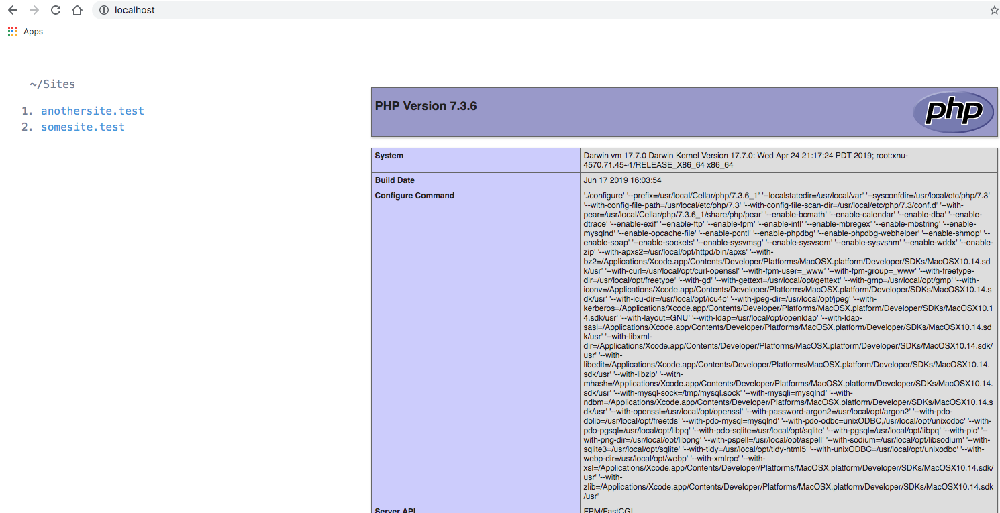

# valet-dashboard

A simple dashboard for Laravel Valet to display all available sites.



A super minimal dashboard which lists each available site for all parked paths as well as Valet-linked sites.

## Installation

1. Clone or download the repo into a directory of your choosing  
E.g. `git clone https://github.com/aaemnnosttv/valet-dashboard.git dashboard`
1. Move the new directory into a Valet-parked path or run `valet link` within it
1. Run `valet open` from within the directory!

## Configure as default site (optional)

If you would like to access your dashboard at http://localhost, simply define the path to your local valet dashboard in as the `default` in your Valet config file.

> Newer installations of Valet put the `config.json` in `~/.config/valet/` while older installations may use `~/.valet/`

```diff
{
+   "default": "/absolute/path/to/valet-dashboard",
    "paths": [],
    "tld": "test"
}
```
